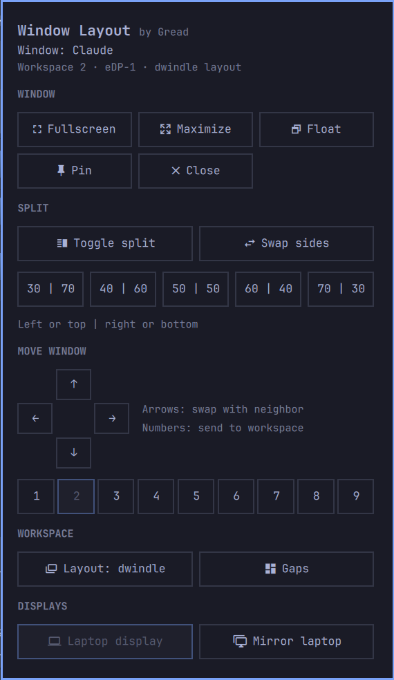

# Window Layout

An [Omarchy](https://omarchy.org) shell plugin for arranging windows with the mouse.
Click the icon in the bar and every tiling move you would otherwise do with a
keybinding is one click away: fullscreen, split direction, split ratios, swapping
windows, sending them to other workspaces or displays, and more.



## What's in the panel

The panel acts on the window that was focused when you opened it. Its title is
shown at the top, so you always know what a button will change.

| Section | Buttons |
|---|---|
| **Window** | Fullscreen · Maximize (keeps the bar visible) · Float · Pin (Omarchy's pop out) · Close |
| **Split** | Toggle split (side by side ⇄ stacked) · Swap sides · Ratios 30/70, 40/60, 50/50, 60/40, 70/30 |
| **Move window** | Swap with the neighbor (↑ ← → ↓) · Send to workspace 1–9 · Send to another display |
| **Workspace** | Toggle dwindle/scrolling layout · Toggle gaps · Move the workspace to another display |
| **Displays** (laptops) | Laptop display on/off · Mirror the laptop display |

Buttons that don't apply right now are dimmed. For example, split ratios need a
tiled window on a dwindle workspace. Display buttons only appear when more than
one display is connected.

## Install

```bash
omarchy plugin add https://github.com/Gread/omarchy-window-layout.git --enable
```

The icon goes to the center of the bar. To put it somewhere else:

```bash
omarchy bar move gread.window-layout --section right
```

Update with `omarchy plugin update gread.window-layout`, remove with
`omarchy plugin remove gread.window-layout`.

## Language

The panel is available in English, Portuguese, and Swedish and follows the system
language, falling back to English. To pick one yourself, set `language` on the
widget entry in `~/.config/omarchy/shell.json` (`auto`, `en`, `pt`, or `sv`):

```json
{ "id": "gread.window-layout", "language": "pt" }
```

## Open it from the keyboard

The panel also answers to Omarchy shell IPC, so you can bind it to a key. In
`~/.config/hypr/bindings.lua`, using any free combination:

```lua
o.bind("SUPER + ALT + W", "Window layout panel", "omarchy-shell gread.window-layout toggle")
```

## Requirements

- Omarchy 4 (`omarchy-shell`) with Hyprland's Lua configuration
- `jq`

## How it works

`BarWidget.qml` and `Panel.qml` draw the icon and the panel. Every button runs
`bin/window-layout` with a fixed argument list. The script validates each argument
before passing it to `hyprctl dispatch`, and calls Omarchy's own commands for
gaps, layout, pop out, and the laptop display. It never uses sudo or the network.

## License

[MIT](LICENSE)
